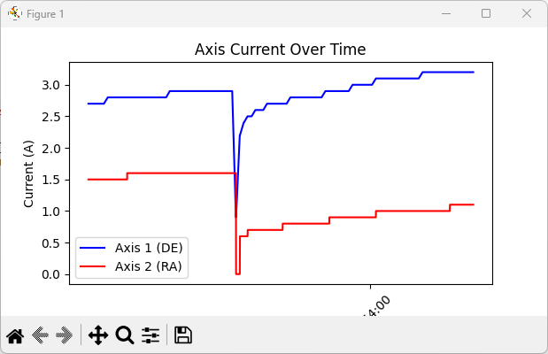

# ASA Current Monitor

ASA Current Monitor is a Python-based tool for real-time monitoring and visualization of axis currents from log files generated by ASA Autoslew. The program dynamically reads the latest log file in a specified folder, processes the data, and plots the current values over time.

## Features

- **Real-Time Monitoring**: Continuously monitors the latest log file for updates.
- **Dynamic Plotting**: Visualizes axis currents (`DE` and `RA`) over time using Matplotlib.
- **Automatic File Selection**: Automatically selects the most recent `.txt` log file from the specified folder.


## Requirements

- Python 3.7 or later
- Required Python libraries:
  - `matplotlib`
  - `tkinter` (comes pre-installed with Python)
  - `datetime`

## Installation

1. Clone the repository:
   ```bash
   git clone https://github.com/your-username/asa-current-monitor.git
   cd asa-current-monitor
   ```

2. Install the required Python libraries:
   ```bash
   pip install matplotlib
   ```

3. Ensure the log files are located in the folder specified in the `LOG_FOLDER` variable in the script.

## Usage

1. Run the script:
   ```bash
   python asacurrent.py
   ```


3. To stop the program, click the "Close" button in the GUI.

## Configuration

- **Log Folder**: Update the `LOG_FOLDER` variable in the script to point to the folder containing your log files:
  ```python
  LOG_FOLDER = "C:\\ProgramData\\ASA\\Autoslew\\ClServoLogs"
  ```


## Example

### Real-Time Plot
The program generates a real-time plot of axis currents (`DE` and `RA`) over time:




